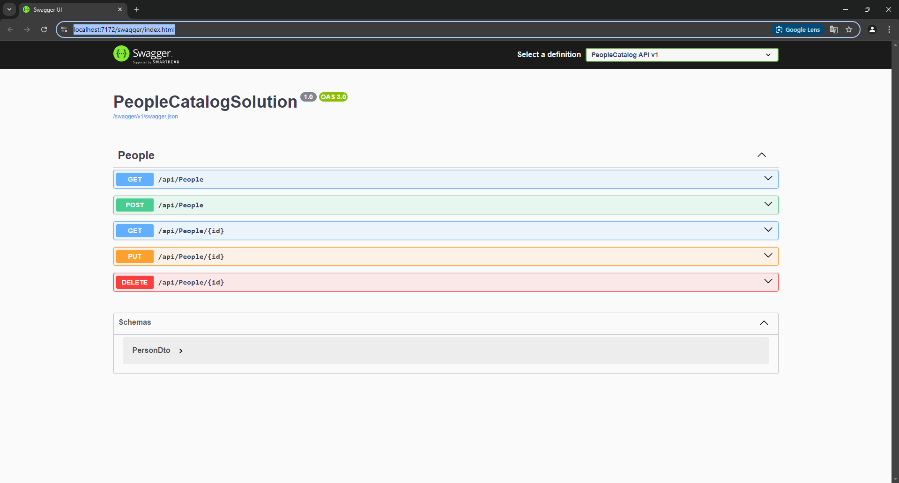
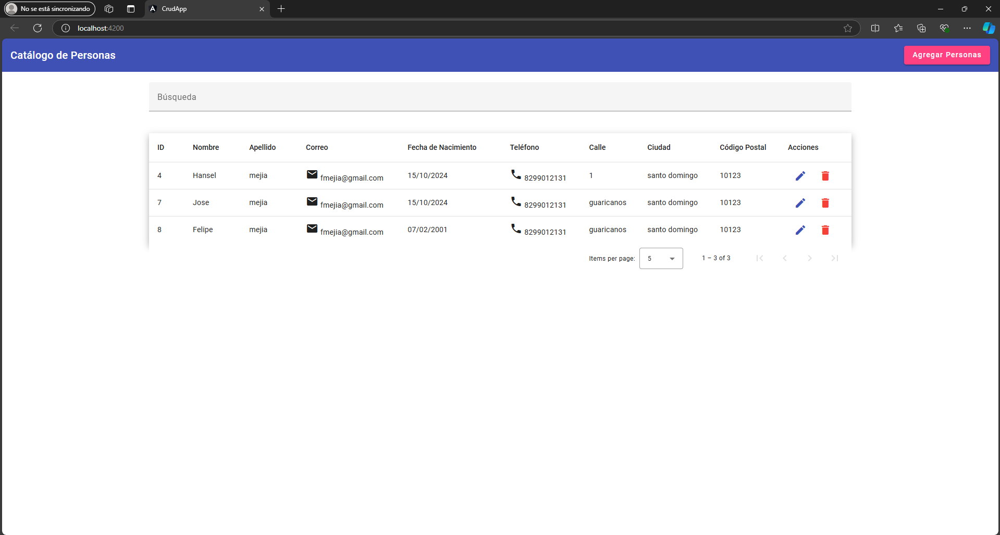

# PeopleCatalog API

Esta es una API para gestionar un catálogo de personas, implementada utilizando los principios de Clean Architecture y CQRS, con integración de Swagger para la documentación.

## Requisitos previos

- .NET 6 SDK o superior
- Docker
- Docker Compose
- MySQL
- Angular CLI (v12 o superior)
- Node.js (v14 o superior)


## Configuración

### 1. Clona el repositorio
```bash
git clone https://github.com/thefelipe001/PeopleCatalogAPI.git
cd PeopleCatalogAPI
```

### 2. Configura la cadena de conexión
Actualiza el archivo `appsettings.json` con los detalles de tu conexión a la base de datos:

```json
{
  "ConnectionStrings": {
    "DefaultConnection": "Server=localhost;Database=PeopleCatalogDB;User=root;Password=1234;"
  },
  "Logging": {
    "LogLevel": {
      "Default": "Information",
      "Microsoft": "Warning",
      "Microsoft.Hosting.Lifetime": "Information"
    }
  },
  "AllowedHosts": "*"
}
```

### 3. Levantar la aplicación con Docker
```bash
docker-compose up --build
```

### 4. Acceso a la API
Una vez que la aplicación esté en funcionamiento, puedes acceder a la documentación Swagger en la siguiente URL:

- `https://localhost:7262/swagger/index.html`

### 5. Base de Datos
Los comandos de migración para la base de datos ya están configurados en el proyecto. El contenedor de Docker levantará una base de datos MySQL con el esquema necesario.

### 6. Pruebas
Las pruebas automatizadas se encuentran en la carpeta `PeopleCatalog.Tests`. Para ejecutarlas, utiliza el siguiente comando:

```bash
dotnet test
```

## Detalles técnicos
- Lenguaje: C# Backend & Angular Frontend
- Framework: .NET 6
- Base de datos: MySQL
- Patrones: Clean Architecture, CQRS, Mediator


### 7. Corrida Frontend

Abre la carpeta angular-crud-app con Visual Studio Code. En el terminal, ejecuta npm install y luego ng serve, asegurándote de que la API esté corriendo en la siguiente URL abrir frontend:

- `http://localhost:4200`




